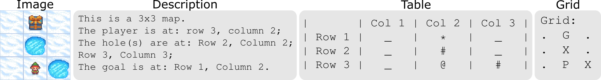
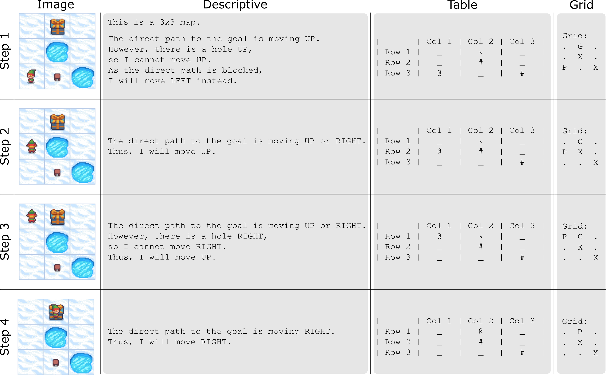

# **On the Out-of-Distribution Generalization of Reasoning in Multimodal LLMs for Simple Visual Planning Tasks**

**Yannic Neuhaus**<sup>1</sup>, **Nicolas Flammarion**<sup>2</sup>, **Matthias Hein**<sup>1</sup>, **Francesco Croce**<sup>3</sup>

<sup>1</sup>*University of Tübingen*
<sup>2</sup>*EPFL* <sup>3</sup>*Aalto University*


[](https://arxiv.org/abs/23XX.XXXXX)

## Data
Download the datasets [here]() and unzip the file in `./data`.

### Input representations
We provide our datasets with four different input representations (the corresponding jsonls contain the substrings "image", "desc", "grid" or "table")
<p align="center">
  
</p>

### Reasoning traces
For the training data, we also provide the reasoning traces
- *desc* : simple descriptive reasoning
- *table* : ASCII visualization of the grid after each step
- *grid* : more concise ASCII visualization of the grid after each step
- *table_desc* / *grid_desc*: combination of the descriptive reasoning with the grid visualizations

<p align="center">
  
</p>


## Environment

```
git clone https://github.com/YanNeu/frozen_ood.git
cd frozen_ood
conda env create -f environment.yml
```
## Fine-tuning

Use `task=sft_text` for the text based inputs and `task=sft_image` for image inputs, e.g.
```
python src/main.py epochs=10 task=sft_text data_path="./data/train/train_grid.jsonl" run_name="sft_grid"
```
to fine-tune the models with grid input and no reasoning and 
```
python src/main.py epochs=10 task=sft_text data_path="./data/train/train_grid_reasoning_grid_desc.jsonl" run_name="sft_grid_reas_grid_desc"
```
for the version with description and grid based reasoning traces.

## Evaluation
After fine-tuning the model you can evaluate it on all ID test sets via

```
python src/eval.py load_model_path="./checkpoints/sft_grid" data_path="./data/train_mirage/test_id/test_level3_4_5_6_grid.jsonl" save_dir="./results_id"
```
or on one of the OOD sets 

```
python src/eval.py load_model_path="./checkpoints/sft_grid" data_path="./data/train_mirage/test_ood/test_level7_grid.jsonl" save_dir="./results_ood"
```

## Citation
*Coming soon!*